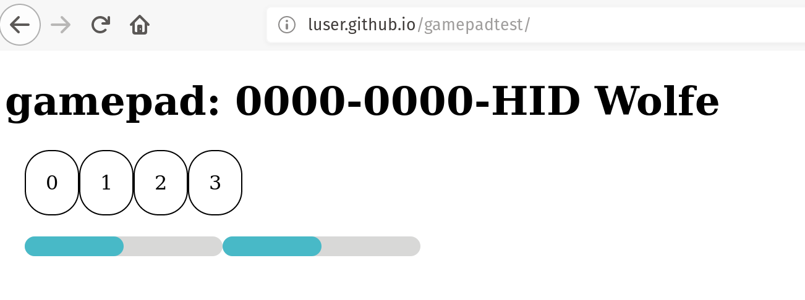

# esp32-hid-joystick

This is a Bluetooth Low Energy (BLE) HID joystick I put together using a [WEMOS D32PRO](https://wiki.wemos.cc/products:d32:d32_pro) and an [Adafruit joystick](https://www.adafruit.com/product/512).

# Why?

The aim of this project is build a functional, cheap and open Joystick/Gamepad device using off the shelf parts, which is battery powered and connects to any PC/Mac/Phone using BLE.

This project currently uses ESP32 micro controller because:

1. It is cheap and widely available.
2. It has an open source SDK which is based on FreeRTOS.
3. Has great out of the box examples of BLE HID devices, which I used as the basis for this project. 
4. All the peripherals I needed to make magic happen.

# How?

The core of this software is its [HID report](main/hid_device_le_prf.c#L39-L70), and [esp_hidd_send_joystick_value](main/esp_hidd_prf_api.c#L144-L157) which transmits the current state of the joystick.

To read the analogue joystick x and y values I am using the [adc driver](https://docs.espressif.com/projects/esp-idf/en/latest/api-reference/peripherals/adc.html).

# Building

This project uses [esp-idf](https://github.com/espressif/esp-idf) and requires a recent version with support for [CMake](https://cmake.org/).

# Usage

The below image shows this joystick detected by chrome after being paired.

Handy gamepad tester used is located at http://luser.github.io/gamepadtest/

# Assembly

TODO Circuit diagram.

J1 connector.

P6 3v3
P5 Sw01     GPIO_14
P4 Sw02     GPIO_25
P3 Sw03     GPIO_26
P2 Sw04     GPIO_27
P1 GND

J2 connector

P1 Sw10     GPIO_19
P2 Sw09     GPIO_18
P3 Sw08     GPIO_17
P4 Sw07     GPIO_16
P5 Sw06     GPIO_05
P6 Sw05     GPIO_04

LEFT_X GPIO_32
LEFT_Y GPIO_33
RIGHT_X GPIO_34
RIGHT_Y GPIO_35

# TODO

* [ ] Make a simple case and wire up a 1S battery
* [ ] Cleanup demo code once I have done some integration testing.
* [ ] Extend it to add a screen, this requires more HID stuff which is challenging.
* [ ] Add add an identify option using an RGB LED so the user knows which is theirs. There is already an LED setup in the HID code.

# Dependencies

* https://github.com/craftmetrics/esp32-button

# References 

* https://eleccelerator.com/tutorial-about-usb-hid-report-descriptors/
* https://www.usb.org/sites/default/files/documents/hut1_12v2.pdf

# License

This project is copyright Mark Wolfe and Espressif Systems (Shanghai) PTE LTD and is released under Apache 2.0 license.